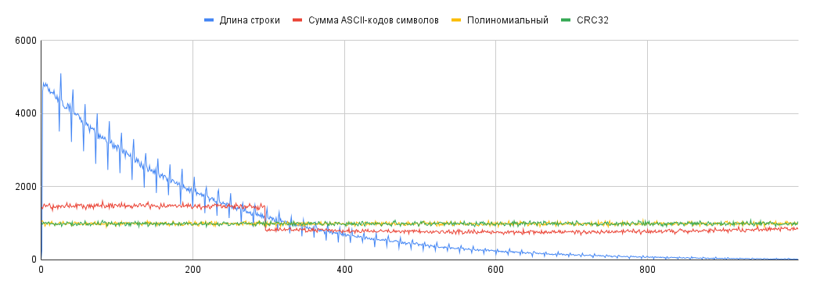

# Хеширование (8б)

## Исследование хеш-Функций
> Сгенерируйте 1000000 случайных ключей(того типа данных, для которого предназначена хеш-функция), и постройте столбчатые диаграммы коллизий для хеш-функции.
> Брать остаток от деления на 1000.

### Целые числа
1) Остаток от деления
2) Битовое представление в unsigned
3) Мультипликативная

График сравнения распределений:

Распределения для первых двух хешей совпадают на неотрицательных ключах. При этом в силу того, что знаковые числа представляются в памяти как байт знака и беззнаковое число, для обоих хеш-функций распределение на случайных отрицательных числах будет аналогичным. Построим график и для отрицательных чисел:

Действительно, функции совпадают и в этом случае.

Средняя длина цепочек равна 1000, стандартное отклонение $31.5$ для первых двух функций и $32$ для третьей, что значит, что с точки зрения распределения все три функции одинаково хороши. Сравним времена работы вычисления хеша для $10^9$ ключей в миллисекундах:

| Остаток от деления на 1000 | Преобразование к unsigned | Мультипликационный |
|-|-|-|
|115 | 117 |1577 |

Таким образом с точки зрения времени работы первые две функции снова одинаково хороши. Третья же функция работает на порядок дольше, что позволяет сделать выбор в пользу первых двух.

### Числа с плавающей точкой
1) (int)
2) Битовое представление в unsigned

В случае с ключами типа float работы хеш-функций отличаются. Действительно, в первом случае ключ округляется до целого. Во втором же случае, из-за особенностей представления в памяти чисел с плавающей точкой (знак, мантисса и порядок), значение хеша существенно отличается от ключа. При этом обе функции дают одинаково равномерное распределение - стандартное отклонение $32.5$ и $32.8$ при средней длине цепочки $1000$ элементов соответственно. При этом времена работы для $10^9$ ключей $138$ и $144$ миллисекунд соответственно. Таким образом, обе функции применимы для чисел с плавающей точкой одинаково хорошо.

### Строки
1) Длинна строки
2) Сумма букв
3) Полиномиальный
4) crc32

Будем генерировать случайный размер строки от $1$ до $1000$, после чего заполнять строку случайными элементами в диапазоне $[0, 255]$. Получается следующее распределение:

Почему размеры цепочек в случае хеширования по длине строки убывают, если длина строки выбиралась как случайное число до $1000$? В список допустимых символов строки мы включили `\0`, являющийся символом окончания строки. Таким образом в случае, если он равновероятен с остальными, он искусственно завершает строку раньше. Исключим из допустимых значений элемента строки число $0$ и запустим тесты заново:

После такого изменения первый хеш дает такое же равномерное распределение, как и остальные функции. Так же наблюдается резкий скачок длин цепочек на значении $296$ для хеш-функции суммы элементов строки. Почему происходит так? При вычислении хеша мы суммируем числа из диапазона $[1, 255]$, выпадение всех чисел равновероятно. Таким образом мат. ожидание хеша для строки длины $n$ составит $n * 254/2 = 126n$, распределение внутри одной длины нормальное. Мы имеем длины строк от $1$ до $1000$, выпадающие с равной вероятностью. Таким образом мы имеем наложение $1000$ графиков нормального распределения с разными растяжениями по горизонтали. Такое распределение будет иметь большее количество ключей в зоне пиков, и меньшее после последнего пика, что и может дать скачок. Сделаем проверку, увеличив размер хеш-таблицы до максимального возможного значения суммы - $255000$. График распределения рассматриваемой хеш-функции выглядит так:

.png)

Таким образом мы действительно имеем распределение, способное дать скачок при взятии по модулю $1000$, за счет пика на значении $2095$.

С точки зрения распределений лучше всего себя показывают полиномиальный хеш и crc32. Действительно, хеш-функция, возвращающая длину строки имеет равномерное распределения исключительно за счет того, что в наших тестах длины строк равновероятны. В случае же хеширования, например, слов естественного языка, распределение будет совпадать с распределением частот встречаемости слов различной длины в этом языке. Аналогично сумма символов зависима от длины слова, которое ограничивает максимальное возможное значение хеша. Таким образом не больших данных из коротких строк таблица будет сильно населена в области небольших хешей и пуста в области больших.

Полиномиальная функция и crc32 могут давать равномерное распределение на сколь угодно больших размерах таблицы, так как являются полиномами, а значит зависят от константы, возводимой в степень. Увеличением этой константы мы можем добиваться увеличения максимального возможного значения хеша.

Сравним теперь времена вычисления хешей для $10^9$ значений:

| Длина строки | Сумма символов | Полиномиальный | CRC32 |
|-|-|-|-|
|17 | 126 |317 | 3811 |

Среди двух хороших хешей - полиномиального и crc32 побеждает полиномиальный хеш, работающий быстрее более чем в $10$ раз. Первые же два хеша работают быстро, но не рекомендуются из-за высокой вероятности плохого распределения.

## Исследование хеш-таблиц (10б)

> Сгенерируйте случайную последовательность операций с хеш-таблицей(Как в задаче +,-,?), все операции считать равновероятными.
> Размеры тестов: 10000, 1000000, шаг 10000 засеките время и постройте графики

### Используйте хеширование цепочками
### Используйте открытое хеширование

> Те же тесты сделать для случая когда вероятность вставки 0.5, а минус и ? 0.25 каждая

Преимущество метода открытого хеширования над методом цепочек заключается в более быстрых поиске и вставке для слабо заселенных таблиц. Работа с единственным массивом вместо массива указателей на списки более дружелюбна к кешу. При вставке нам достаточно найти первое свободное место, которое находится быстро для разреженных таблиц, и не требуется аллоцировать новую память. Более того, после того, как будут совершены удаления мы сможем вставлять элементы на освобожденные позиции, что будет ещё быстрее. За счет этого при увеличении доли команд вставки метод цепочек замедляется относительно открытого хеширования.

Из минусов открытого хеширования можно отметить долгие поиск и вставку при сильной заполненности. В таком случае для того, чтобы найти свободное место нам может потребоваться пройти элементы из других цепочек, и количество пройденных элементов может быть близким к размеру массива. В случае же метода цепочек мы гарантированно пройдем не больше элементов, чем содержится в нашей цепочке.

Более того, при открытом хешировании количество элементов не может превысить размеры таблицы, хотя для метода цепочек это является допустимым.

Таким образом выбор между методами хеширования неоднозначен и зависит от целей использования хеш-таблицы.
