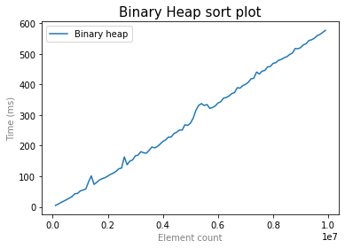
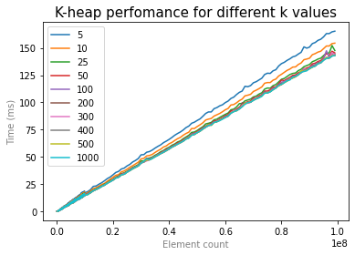

# Кучи

## Пункт 1. Бинарная куча (2б)
> * Тесты генерируются как и в предыдущей лабе, размер массива от 100000 до 10000000, шаг 100000, для каждого размера 5 измерений.
> * Cделать heapsort для обычной бинарной кучи.
> * Засечь времена работы. Построить графики.
> 

Время работы сортировки линейно по размеру массива.

## Пункт 2. k-ичная куча (5б)
### Базовая реализация
> * Тесты генерируются как и в предыдущей лабе, размер массива от 100000 до 10000000, шаг 100000, для каждого размера 5 измерений.
> * Написать k-ичную кучу. Cделать HeapSort с помощью k-ичной кучи
> * Протестить для k = 5,10,25, 50, 100, 200, 300, 400, 500, 1000
> * Засечь времена работы. Построить графики.
### Оптимизация 
> * Добавить поиск min/max ребенка с помощью бинарной кучи. Чтобы SiftDown заботал за O(log(k) log_k(N))
> * Протестить для k = 5,10,25, 50, 100, 200, 300, 400, 500, 1000
> * Засечь времена работы. Построить графики.
> 
> Стало ли лучше?

 

С увеличением количества детей наблюдается ускорение. При этом заметный прирост производительности наблюдается только на небольших количествах, начиная же с $50$ увеличение количества детей перестает изменять скорость работы.

Относительно бинарной кучи увеличение количества детей до 5 увеличивает скорость работы в разы, в частности за $100$ ms бинарная куча сортирует массив размера $0.2 * 10^7$, а куча с $k = 5$ массив размера $6 * 10^7$.

## Пункт 3. Биномиальная куча* (+2б)
> * Тесты генерируются как и в предыдущей лабе, размер массива от 100000 до 10000000, шаг 100000, для каждого размера 5 измерений.
> * Теперь HeapSort-им с помощью биномиальной кучи.
> * Засечь времена работы. Построить графики.
> * 

## Пункт 4. Фиббоначева куча* (+3б)
> * Тесты генерируются как и в предыдущей лабе, размер массива от 100000 до 10000000, шаг 100000, для каждого размера 5 измерений.
> * Теперь HeapSort-им с помощью фиббоначевой кучи.
> * Засечь времена работы. Построить графики.
 
## Пункт 5. Слабая куча* (+5б)
> * Тесты генерируются как и в предыдущей лабе, размер массива от 100000 до 10000000, шаг 100000, для каждого размера 5 измерений.
> * Статья https://core.ac.uk/download/pdf/269228617.pdf
> * Теперь HeapSort-им с помощью слабой кучи.
> * Засечь времена работы. Построить графики.
 
## Пункт 6. Вывод (1б)
> Сделайте выводы о работе куч.

Опираясь на произведенное выше сравнение бинарных и $k$-ичных куч можно сделать вывод о преимуществе $k$-ичной кучи с точки зрения времени работы. При этом среди $k$-ичных куч имеет смысл говорить об увеличении размера до $50$ детей, большее увеличение не дает ускорения и может замедлять работу из-за поиска необходимого ребенка в большом списке.
