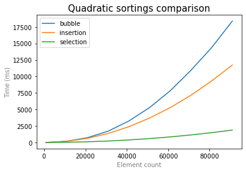
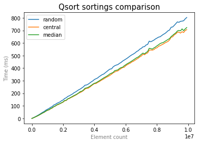
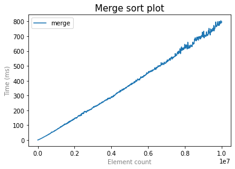
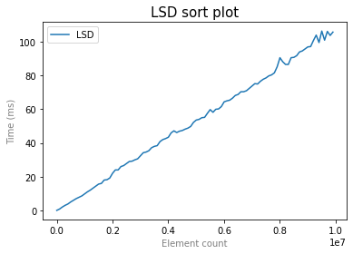

# Cравнение сортировок

## Пункт 1. Cортировка вставками, пузырьком, выбором (2 б).
> Напишите сортировки вставками, пузырьком, выбором.
> Запускаем тест для массивов размера от 1000 до 1000000 с шагом 10000.
> Для каждого размера гененрируем массив, и сортируем, засечь время работы сортировки.
> *Все три сортировки тестим на одинаковых массивах*
> Для кажого размера и каждой сортировки делаем 5 тестов и усредняем итог.
> Построить график для каждой сортировки(из 100 точек). 

> Советую строить с помощью python.
> https://pythonru.com/biblioteki/pyplot-uroki?ysclid=le6cok2zm0349935651 
> Какая в итоге отработала лучше?

## Пункт 2. Быстрая сортировка  (3 б. + 2 бонус).
> Делаем то же самое(такие же тесты, только теперь размеры до 10 млн, но шаг 100000.), используем разные стратегии выбора опорного эелемента:
> *Сортировка и первые три пункта - это 3 б.*
> * медиана 3х 
> * центральный 
> * случайный 
> * медиана медиан (+2б)
> Какая стратегия оптимальна?

## Пункт 3. Сортировка слиянием (2 б).
> Добавить сортировку слиянием(такие же тесты, только теперь размеры до 10 млн, но шаг 100000).

## Пункт 4. Цифровая сортировка(LSD + MSD*) (3 б. + 4 бонус).
> * Добавить цифровую сортировку(LSD) для uint32_y (такие же тесты, только теперь размеры до 10 млн, но шаг 100000).
> * Добавить MSD сортировку для uint32_y (такие же тесты, только теперь размеры до 10 млн). (+2б), что в итоге лучше для чиселок сработало?
> * Добавить MSD сортировку для строк, потестить на массивах строк (+2б)

> Как тестить строки?
> 
> * Тест 1. Генерируем N строк длины K=1000 по буквам, все буквы равновероятны.
> * Тест 2. Генерируем N строк длины от 1 до N=1000000 по буквам, все буквы равновероятны. Случайно перемешиваем.
> 
## Пункт 5. Выводы (1б.)
> Напишите вывод(что удивило, что узнали нового)

LSD сортровка работает быстрее остальных, но не является универсальной, используя информацию о структуре сортируемых объектов. В частном случае сравнения чисел она хороша по времени. Среди логарифмических сортировок лидирует qsort с выбором среднего по номеру элемента, вероятно за счет отсутствия необходимости дополнительных вычислений. Merge в среднем работает чуть хуже избавленных от случайности вариантов qsort, однако лучше версии с выбором случайного опорного элемента. Квадратичные сортировки, очевидно, работают гораздо хуже логарифмтческих по времени, поэтому не были включены в итоговый график. В сравнении квадратичных сортировок удивило то, что пузырьковая в несколько раз отстает от сортровки выбором.