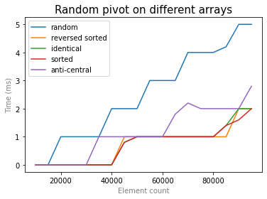

# Cравнение сортировок

## Пункт 1. Cортировка вставками, пузырьком, выбором (2 б).
> Напишите сортировки вставками, пузырьком, выбором.
> Запускаем тест для массивов размера от 1000 до 1000000 с шагом 10000.
> Для каждого размера гененрируем массив, и сортируем, засечь время работы сортировки.
> *Все три сортировки тестим на одинаковых массивах*
> Для кажого размера и каждой сортировки делаем 5 тестов и усредняем итог.
> Построить график для каждой сортировки(из 100 точек). 
>
> Советую строить с помощью python.
> https://pythonru.com/biblioteki/pyplot-uroki?ysclid=le6cok2zm0349935651 
>
> Какая в итоге отработала лучше?

Исходный код сортировок для тестирования лежит в папках `bubble`, `insertion` и `selection` соответственно. Измерение времен производилось при помощи тестов в файлах `testing/benchmark1.cpp` и `testing/benchmark5.cpp`, результаты измерений лежат в файлах `testing/data/bench1.txt` и `testing/data/bench5.txt` соответственно. При первом измерении производилось сравнение сортировок без оптимизаций. Результаты следующие:

Как видно из графиков, сортировки имеют одинаковую (квадратичную) асимптотику с разными константами. Пузырьковая сортировка проигрывает сортировке вставками, они обе заметно проигрывают сортировке выбором. Почему так получается? На константу влияет количество операций, произведенных на каждом шаге между рекурсивными вызовами, в частности количество перестановок элементов местами. Пузырьковая сортировка проходит по ещё не отсортированной части массива, производя обмен элементов, если он требуется, а значит для случайного массива примерно половина сравнений окончится перестановкой. Сортировка вставками наоборот проходит по уже отсортированной части массива, производя обмены, пока элемент не окажется на своем месте, таким образом для случайного массива потребуется переставить примерно половину уже отсортированных значений. Сортировка выбором в отличие от двух других не требует такого большого количества перестановок, на каждой иттерации производя обмен первого элемента не на своем месте с элементом, который должен стоять на месте рассматриваемого. Таким образом за счет меньшего количества обменов уменьшается константа.

Попробуем произвести оптимизации. Для того, чтобы вставить элемент в insertion sort требуется менять местами все большие уже отсортированные элементы. При этом каждый обмен требует вызова функции и изменения значений в двух ячейках массива. Чтобы уменьшить количество операций, можно сразу ставть каждый элемент на свое место, то есть на каждом шаге изменять не две, а одну ячейку массива. Для этого сдвинем каждый элемент на один вправо, проходясь справа налево и заменяя значение в ячейке на стоящее слева от него. После этого в освободившуюся левую ячейку можно вставить самый правый элемент, то есть как раз тот, который нужно было. Таким образом мы сокращаем количество обменов на каждом шаге в два раза. 

Дополнительно можно воспользоваться знанием об упорядоченности префикса массива, находя место для вставки элемента при помощи бин. поиска, это позволит искать его за логарифмическое по размеру отсортированной части время вместо линейного.

На следующем графике предствлено сравнение сортировки вставками без оптимизаций с сортировкой вставками со сдвигом части массива и со сдвигом и использованием бинпоиска:

Исходный код тестов и разультаты измерений лежат в файлах `testing/benchmark5.cpp` и `testing/data/bench5.txt` соответственно.

Мы видим, что использование оптимизаций действительно ускоряет работу. При этом разница от добавления бинпоиска видна не так сильно как при улучшении обмена элементов из-за того, что поиск занимает меньшую долю времени от всей сортировки из-за того, что только сравнивает и не пишет в память, а значит его улучшение слабее повлияет на общее улучшение программы.

Сравним теперь оптимизированную сортировку вставками с сортировкой выбором:

Благодаря оптимизации сортировки почти сравнялись. При этом сортировка выбором выигрывает за счет константного количества сравнений и проигрывает за счет линейного по размеру неотсортированной части поиска подходящего элемента, а сортировка вставками выигрывает за счет логарифмического по размеру отсортированной части поиска места для вставки и проигрывает за счет линейного по размеру отсортированной части количества перестановок. Выбор конкретной сортировки в данном случае зависит от констант, связанных со временем сравнения и перестановки элементов массива, потому как в случае быстрого сравнения и долгой перестановки преимущество будет иметь сортировка выбором, способная быстро переставлять, а в обратном случае выиграет сортировка вставками, способная быстро искать.

## Пункт 2. Быстрая сортировка  (3 б. + 2 бонус).
> Делаем то же самое(такие же тесты, только теперь размеры до 10 млн, но шаг 100000.), используем разные стратегии выбора опорного эелемента:
> *Сортировка и первые три пункта - это 3 б.*
> * медиана 3х 
> * центральный 
> * случайный 
> * медиана медиан (+2б)
>
> Какая стратегия оптимальна?

Быстрая сортировка с первыми тремя вариантами выбора опорного элемента лежат в файлах папки `qsort`. Тестирование на случайных массивах показывает следующие результаты:

Исходный код бенчмарка можно найти в файле `testing/benchmark2.cpp`, результаты измерений лежат в файле `testing/data/bench2.txt`.

Проанализируем дополнительно особые случаи входных массивов и работу различных вариантов сортировки на них. У нас есть 2 детерминированных способа выбора опорного элемента - центральный и медиана центрального и двух крайних элементов. 

Когда сортировка работает хорошо? Когда разделение массива опорным элементом на две части происходит примерно посередине - в таком случае время работы сводится к `O(nlog(n))`. Подходящими являются, например:
* уже отсортированный массив, где разбиение всегда происходит посередине и нет перемещений элементов, 
* отсортированный в обратном порядке массив, где разбиение всегда происходит посередине и части с двух сторон от опорного элемента меняются местами, не нарушая обратную отсортированность,
* массив из одинаковых элементов, для которого работа алгоритма будет аналогична отсортированному массиву.

На следующих графиках представлены результаты измерений времени для хороших и случайных массивов для двух способов выбора опорного элемента, указанных выше:

Код для измерений представлен в файле `benchmark6` в папке `testing`, результаты измерений в папке `testing/data` в файле `bench6_1.txt`. Результаты показывают, что сортировки действительно работают на "хороших" массивах заметно лучше, чем на случайных.

Плохими для таких способов выбора будут случаи, когда массив разбивается на две части неравномерно, в частности выбор максимального элемента в качестве опорного будет отсекать по одному элементу на каждом шаге рекурсии. Такой массив можно создать из отсортированного, пройдя по нему от начала до конца, обменивая при этом на каждом i-м шаге i-й и (i/2)-й элементы. Тогда на каждом шаге рекурсии средним будет являться элемент, который был бы крайним для тех же границ отсортированного массива. Таким образом на каждом шаге мы будем проходить по массиву и перемещать наибольший элемент в конец. Потребуется количество шагов рекурсии равное размеру массива, а значит сортировка станет квадратичной.

Сортировка при помощи выбора медианы трех так же будет замедляться в таком случае, хоть и не так сильно, как выбор среднего элемента.

Сравнение плохого случая с остальными для выбора опорного элемента как среднего и медианы трех можно найти на графиках ниже: 

Код для измерений представлен в файле `benchmark6` в папке `testing`, результаты измерений в папке `testing/data` в файле `bench6_2.txt`. Результаты показывают, что сортировки показывают заметное замедление работы сортировок на "плохом" массиве, связанное с изменением асимптотики.

Измерения с данными массивами так же производились и для недетерминированного выбора опорного элемента одновременно с остальными иземерениями (данные и исходный код тестов можно найти в тех же файлах). Графики для него представлены ниже:

На "хороших" массивах быстрее работает и сортировка с выбором случайного опорного элемента в силу того, что число перестановок уменьшается. "Плохие" же массивы не замедляют его по сравнению со случайными в силу того, что не являются специально подобранными для него, и наоборот даже ускоряют работу. Сравним теперь работу различных сортировок на одних и тех же массивах:

"Хорошие" и "плохие" сортировки действительно оказывают наибольшее влияние на те виды выбора опорного элемента, под которые были подобраны. На массиве же случайных элементов распределение по скорости работы происходит в основном за счет константы, требующейся на выбор опорного элемента - выбрать средний быстро, найти медиану трех элементов незначительно дольше, а генерация случайного числа занимает значительное время по сравнению с выбором среднего или медианного варианта.

Таким образом выбор случайного элемента хорош за счет того, что позволяет избежать значительного замедления в случае "плохих" массивов так как выпадение наибольшего или наименьшего элемента на всех шагах маловероятно. При этом он же плох своей случайностью - он может работать нестабильно и вероятность выбора плохих вариантов действительно существует. Так же за счет затрат на генерацию случайного числа такой способ в среднем работает медленнее более простых.

Выбор центрального значения и медианы из центрального и крайнего элемента хороши отсутствием влияния случайности на работу алгоритма. При этом для них существуют массивы, способные замедлять работу вплоть до квадратичной асимптотики. Ещё один аргумент против таких асимптотик - рекурсивные вызовы. В случае отсечения на каждои шаге всего одного элемента нам потребуется количество рекурсивных вызовов быстрой сортировки равное размеру массива, что может вызвать переполнение стека программы в случае больших массивов.

## Пункт 3. Сортировка слиянием (2 б).
> Добавить сортировку слиянием(такие же тесты, только теперь размеры до 10 млн, но шаг 100000).

Сортировка слиянием лежит в папке `merge`, так же для оптимизации используется сортировка вставками со всеми оптимизациями, находящаяся в папке `insertion`. Тестирование без оптимизаций выдает следующие результаты:

Исходный код для измерения времени лежит в файле `testing/benchmark3.cpp`, результаты измерений лежат в файле `testing/data/bench3_1.txt`. Результаты измерений с оптимизациями лежат в файле `testing/data/bench3_2.txt`.

Попробуем оптимизировать классический вариант. Заметим, что сортировка слиянием рекурсивная, а значит её вызов на массивах маленького размера производится часто и тратит значительное время на вызов функции. Вспомним, что квадратичные сортировки устроены проще и не требуют рекурсии, а значит лишены такой значительной потери времени на маленьких подмассивах. Попробуем переключаться на insertion sort при достижении некоторого критического минимального размера массива и подберем оптимальный такой размер. Для этого проведем измерения времени для разных критических значений, в данном случае это массив [0, 5, 10, 25, 50, 75, 100]. Результаты предствалены на следующих графиках:

На первом графике можно увидеть, как сильно сортировка без использования переключения на сортировку вставками отстает от остальных, на втором представлены те же значение, но сортировка без переключения не отрисована ради масштаба. Среди всех лидирует вариант с переключением на 10 элементах, однако для небольших размеров линии достаточно близко, что портит наглядность. Поэтому построим графики зависимости времени исполнения от критического размера для различных размеров массивов:

Так же рассмотрим все значения отдельно:

Таким образом явным лидером становится вариант с критическим размером, равным 10: он и получает преимущества от уменьшения количества рекурсивных вызовов, и не теряет время за счет использования сортировки с квадратичной асимптотикой на больших подмассивах.

## Пункт 4. Цифровая сортировка(LSD + MSD*) (3 б. + 4 бонус).
> * Добавить цифровую сортировку(LSD) для uint32_y (такие же тесты, только теперь размеры до 10 млн, но шаг 100000).
> * Добавить MSD сортировку для uint32_y (такие же тесты, только теперь размеры до 10 млн). (+2б), что в итоге лучше для чиселок сработало?
> * Добавить MSD сортировку для строк, потестить на массивах строк (+2б)
>
> Как тестить строки?
> 
> * Тест 1. Генерируем N строк длины K=1000 по буквам, все буквы равновероятны.
> * Тест 2. Генерируем N строк длины от 1 до N=1000000 по буквам, все буквы равновероятны. Случайно перемешиваем.
> 

Измерение времени показывает следующие результаты:

Сортировка показывает линейные результаты как и должна была. Действительно, мы фиксированное количество раз (равное количеству разрядов максимального числа) сортируем массив сортировкой подстчетом, работающей за линейное по размеру массива время. Интереснее посмотреть на неё в сравнении с другими сортировками.

## Пункт 5. Выводы (1б.)
> Напишите вывод(что удивило, что узнали нового)

Сравним сортировки вместе:

Сраза видно, что квадратичные сортировки заметно проигрывают остальным в прямом сравнении (даже самая быстрая из них selection sort), поэтому построим так же график без квадратичных сортировок:

Мы видим, что константа действительно имеет значение в случае реальных сортировок: после хорошей оптимизации merge sort не уступает линейной LSD. Асимптотики у них разные, а значит разницу можно будет почувствовать, но на гораздо больших размерах массивов. Здесь же можно сделать вывод о том, что квадратичные сортировки не так бесполезны, как кажутся, и хоть и были выкинуты с графика с большими массивами, на маленьких размерах (например на полученном нами 10) работают лучше, чем рекурсивные логарифмические сортировки. 

При всем этом сортировка LSD будет обходить остальные как на маленьких, так и на больших массивах за счет своей линейности и нерекурсивности. При этом она хороша благодрая тому, что использует информацию о том, как устроены сравниваемые данные, в нашем случае числа, а значит будет менее универсальной.

Быстрая сортировка хороша в сравнении с сортировкой слиянием возможностью выполнения на месте, то есть без требования дополнительной памяти. Однако сортировка слиянием является более предсказуемой с точки зрения времени работы так как не опирается на случайность и не требует выбора опорного элемента, который может быть как удачным, так и неудачным в зависимости от случая.

Более подробные выводы по первым трем пунктам так же можно найти в соответствующих разделах README.md.